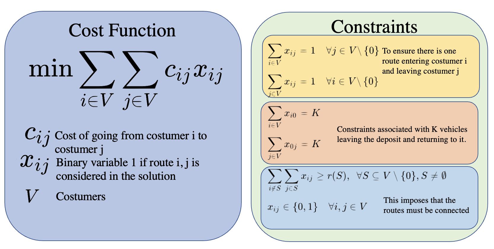
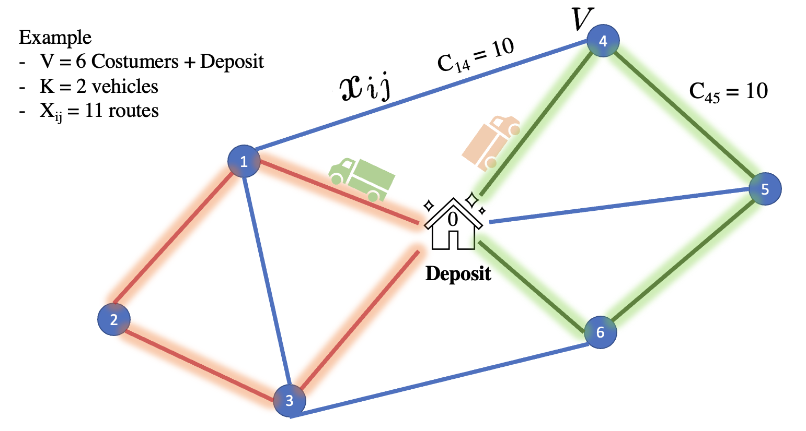
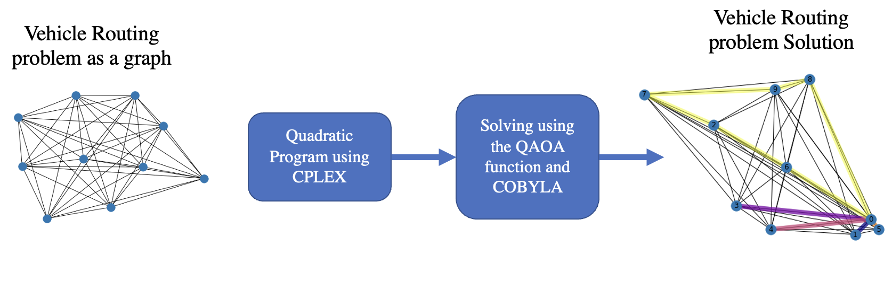
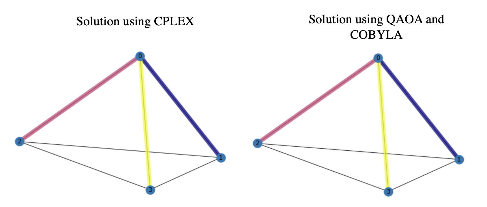
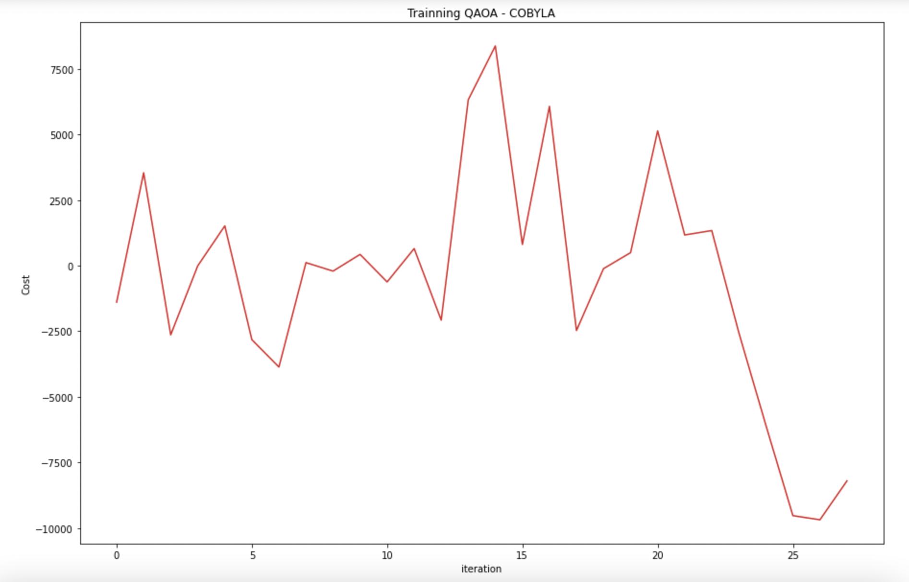

# Quantum pathfinder: the vehicle routing optimal solver

Quantum pathfinder is a optimization tool designed to find the optimal set of routes for a number of vehicles to traverse in order to deliver to a given set of customers. Quantum Pathfinder uses a quadratic unconstrained binary optimization (**QUBO**) representation of the well-known problem of the Vehicle Routing Problem [VRP](https://en.wikipedia.org/wiki/Vehicle_routing_problem) and solves it using the Quantum Approximation Optimization Algorithm **(QAOA)**. We compare the results using QAOA and CPLEX a classical solver. 

# Problem 

In this case we implement a problem with 5 customers and 3 vehicles. The problem is solved using QAOA and COBYLA with two different backends. The backends are the Qiskit Aer simulator and the amazon local simulator. 

# Conclusion

- The QAOA algorithm gives the same solution as CPLEX for the problem proposed which means that the QAOA is getting the optimal solution for this problem.
- The Pennylane solution needs an improvement to classify the correct solution. However, we create a function that combines a model from CPLEX QuadraticProgram and pennylane. This tool will be helpful for a easier user interface to encode QUBO problems.
- Future work involves using real devices with error mitigation

