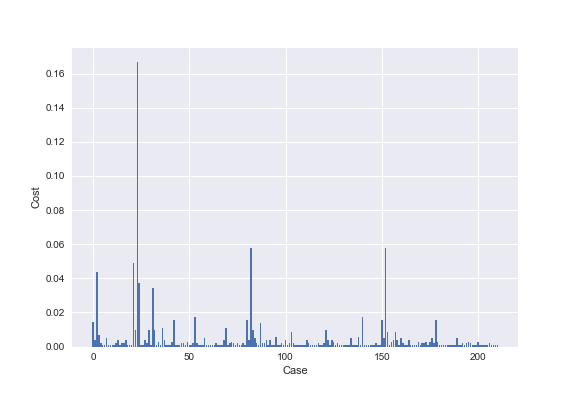

# Quantum pathfinder: the vehicle routing optimal solver

Quantum pathfinder is an optimization tool designed to find the optimal set of routes for a number of vehicles to traverse in order to deliver to a given set of customers. Quantum Pathfinder uses a quadratic unconstrained binary optimization (**QUBO**) representation of the well-known problem of the Vehicle Routing Problem [VRP](https://en.wikipedia.org/wiki/Vehicle_routing_problem) and solves it using the Quantum Approximation Optimization Algorithm **(QAOA)**. We compare the results using QAOA and CPLEX a classical solver. 

# Problem 

In this case, we implement a problem with 5 customers and 3 vehicles. The problem is solved using QAOA and COBYLA with two different backends. The backends are the Qiskit Aer simulator and the amazon local simulator. The Figure below shows that QAOA reaches the desired solution. The COBYLA cost function evolution is also shown below. 

## AWS local simulator using pennylane

# instructions on running the project

To run this project you must clone this repository on your local machine, and apply in the terminal the command

pip install -r requirements.txt

In case you use the notebook it should be
!pip install -r requirements.txt

In case you use google colab you should run the above command and restart the kernel and run it again to initialize all the dependencies.

Subsequently, you should consider that you have the file 
qaoa_pennylane.py which has the necessary classes to make the qaoa in pennylane.

Finally, run the Quantum Pathfinder - the vehicle routing optimal solver.ipynb file step by step following the documented process.

# Conclusion

- The QAOA algorithm gives the same solution as CPLEX for the problem proposed which means that the QAOA is getting the optimal solution for this problem.
- The Pennylane solution needs an improvement to classify the correct solution. However, we create a function that combines a model from CPLEX QuadraticProgram and pennylane. This tool will be helpful for a easier user interface to encode QUBO problems.
- Future work involves using real devices with error mitigation

